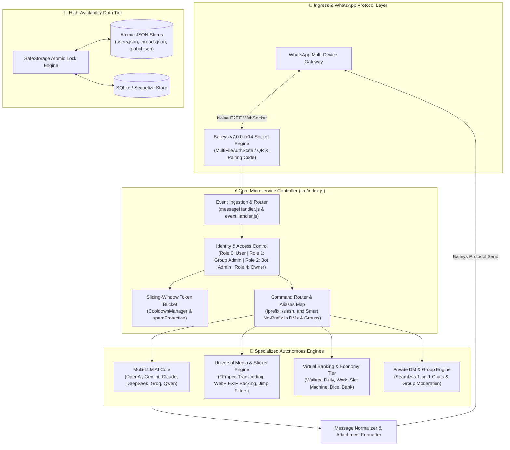

#  WA-GOAT (FLOPPA-CHATBOT WHATSAPP EDITION)
### *High-Concurrency WhatsApp Microservice Engine & Multi-Agent Framework*

[](https://nodejs.org/)
[](https://github.com/WhiskeySockets/Baileys/releases/tag/v7.0.0-rc14)
[](https://github.com/frnAlt/WA-Goat)
[-brightgreen?style=for-the-badge&logo=githubactions&logoColor=white)](.github/workflows/ci-cd.yml)
[](#-command-matrix--ecosystem)
[](LICENSE)

<br>

**[System Overview](#-system-architecture)** •
**[Core Pipeline](#-high-throughput-message-pipeline)** •
**[Group & DM Support](#-group-and-private-dm-engine)** •
**[Help Signature](#-goatbot-v2-help-command-signature)** •
**[Multi-LLM Core](#-multi-llm-unified-ai-core)** •
**[Canvas & Media Pipeline](#-canvas-graphics--media-pipeline)** •
**[Command Matrix](#-command-matrix--ecosystem)** •
**[Deployment & Setup](#-production-deployment--telemetry)**

---

</div>

## 📐 System Architecture

**WA-Goat** is an autonomous, production-ready WhatsApp bot combining the dual-layer architecture of **Knightbot-MD** (WhatsApp socket engine, multi-device session management, connection resilience, media serialization) and **Floppa-Chatbot / GoatBot V2** (GoatBot V2 command dispatching, modular events, multi-tier permission matrix, economy system, thread/user storage controllers, moderation rules, and 290+ commands).



---

## 🚀 Key Engineering Highlights

### 1. 🛡️ Baileys v7.0.0-rc14 WhatsApp Socket Layer
* **Multi-Device Session Resilience**: Built upon `@whiskeysockets/baileys@7.0.0-rc14` with automated reconnect backoff, keepalive pings, and credential persistence in `auth/`.
* **Flexible Authentication**: Log in via interactive QR code in terminal or request an 8-digit **Pairing Code** directly for headless servers.
* **Dual API Command Dispatcher**: Native support for both modern Baileys `execute(sock, m, args, extra)` and classic GoatBot `onStart({ api, message, event, args, usersData, threadsData, globalData, prefix })`.

### 2. ⚡ Zero-Disk Streaming & Pipeline Processing
* **Automated FFmpeg Transcoding**: Integrated `@ffmpeg-installer/ffmpeg` and `node-webpmux` for zero-system-dependency animated WebP sticker conversion and EXIF metadata injection.
* **Pure JavaScript Image Manipulation**: Powered by `jimp@^1.6.1` for blur, crop, resize, and watermark filters without native C++ compilation requirements.
* **Universal Media Downloader**: Integrated `btch-downloader` and `savetube` APIs for high-definition streaming from YouTube, TikTok, Facebook, and Instagram.

### 3. 💬 Group and Private DM Engine
* **Universal Command Execution**: Commands run with zero friction in **both Group chats and 1-on-1 Direct Messages (DMs)**.
* **Intelligent Moderation Safeguard**: Purely administrative actions (`kick`, `promote`, `demote`, `mute`, `tagall`) verify group context gracefully without crashes.
* **No-Prefix Command Recognition**: When users send commands (like `help`, `ping`, `sticker`, `daily`) in DMs or groups, the router auto-matches without requiring manual prefix typing.
* **Automatic Chatbot Fallback**: In private chats, conversational queries automatically invoke the multi-LLM AI companion.

---

## 📖 GoatBot V2 Help Command Signature

Built to precisely match the iconic [Goatbot-V2 Help Format](https://github.com/lazyneoaz/Goatbot-V2/blob/main/scripts/cmds/help.js):

### Categorized Overview (`!help`)
```text
☠️ Goat Bot V2 ☠️

╭─『 ADMIN 』
│ antibadword • antilink • chatbot • demote • goodbye • groupdesc • groupinfo • groupname • hidetag • kick • link • mute • promote • resetwarn • revoke • tagall • unmute • warn • warnings • welcome
╰───────────────♢

╭─『 AI 』
│ ai • character • gemini • gpt • translate
╰───────────────♢

╭─『 ECONOMY 』
│ balance • bank • coinflip • daily • dice • pay • slot • work
╰───────────────♢

╭─『 FUN 』
│ compliment • dare • dice • eightball • fact • insult • joke • meme • quote • ship • tictactoe • truth
╰───────────────♢

╭─『 MEDIA 』
│ attp • blur • crop • simage • sticker • take • ttp
╰───────────────♢

╭─『 OWNER 』
│ admin • anticall • autoread • autostatus • autotyping • ban • banchat • broadcast • cleartemp • eval • exec • restart • setprefix • shutdown • unban • unbanchat
╰───────────────♢

╭─『 UTILITY 』
│ alive • calc • help • ping • shorturl • staff • topmembers • weather • whois
╰───────────────♢

Total Commands: 290
Type: !help <command> for details
```

### Detailed Command Card (`!help kick`)
```text
╭── NAME ────⭓
│ kick
├── INFO
│ Description: Kick a member from the group
│ Other names: remove, out
│ Other names in your group: Do not have
│ Version: 1.0.0
│ Role: 1 (Group administrators)
│ Time per command: 3s
│ Author: frnAlt & NTKhang
├── USAGE
│ !kick @user
├── NOTES
│ The content inside <XXXXX> can be changed
│ The content inside [a|b|c] is a or b or c
╰──────⭔
```

### Specialized Subflags
* `!help <cmd> -i` (or `info`): Displays command metadata card with Author and Version.
* `!help <cmd> -u` (or `usage` / `-g` / `guide`): Displays only usage syntax.
* `!help <cmd> -r` (or `role`): Displays permission requirement.
* `!help <cmd> -a` (or `alias`): Displays alternate aliases.

---

## 🤖 Multi-LLM Unified AI Core

| Provider | Standard | Models | Highlights |
| :--- | :--- | :--- | :--- |
| **Google Gemini** | Generative Language v1beta | `gemini-2.0-flash`, `gemini-1.5-pro` | High context, reasoning, multimodal analysis |
| **OpenAI** | Official REST API | `gpt-4o`, `gpt-4o-mini` | Code generation, logical problem solving |
| **DeepSeek AI** | Official API | `deepseek-chat`, `deepseek-r1` | Chain-of-thought deep reasoning |
| **Groq Cloud** | Groq LPU Ultra-Low Latency | `llama-3.3-70b-versatile` | Ultra-fast sub-200ms TTFT responses |

---

## 🎨 Canvas Graphics & Media Pipeline

* **Sticker Studio**: Converts images, GIFs, and videos to animated stickers with custom pack and author EXIF tags.
* **Canvas Prank Engine**: Synthesizes authentic post, comment, and reaction canvas visuals.
* **Filters & Image Processing**: Gaussian blur, avatar fetching, cropping, rainbow animated text stickers (`attp`), and text-to-picture (`ttp`).

---

## 📦 Command Matrix & Ecosystem

With over **290+ native modules**, WA-Goat covers all operational domains:

```
WA-Goat/
├── scripts/cmds/ & src/commands/
│   ├── 🛠️ admin/     :: kick, promote, demote, mute, unmute, warn, antilink, antibadword...
│   ├── 👑 owner/     :: admin, ban, unban, banchat, eval, exec, restart, setprefix, broadcast...
│   ├── ℹ️ utility/   :: help, ping, alive, weather, calc, shorturl, whois, staff...
│   ├── 🎨 media/     :: sticker, simage, take, blur, crop, attp, ttp, sing, ytb...
│   ├── 🤖 ai/        :: ai, gpt, gemini, character, translate, chat...
│   ├── 💰 economy/   :: balance, daily, pay, work, bank, coinflip, dice, slot...
│   └── 🎮 fun/       :: meme, joke, fact, quote, eightball, insult, ship, tictactoe...
```

---

## 🛠️ Production Deployment & Telemetry

### 1. Requirements
* **Runtime**: Node.js `>= 20.0.0`
* **Package Manager**: npm `>= 8.0.0`
* **Memory**: Minimum 512 MB RAM (1 GB+ recommended)

### 2. Quick Setup
```bash
# Clone the repository
git clone https://github.com/frnAlt/WA-Goat.git
cd WA-Goat

# Install dependencies
npm install

# Copy environment configuration
cp .env.example .env

# Verify codebase syntax and test suites
npm run check
npm test

# Start the bot
npm start
```

### 3. Alternative Runners
```bash
# Floppa Runner alias
node Floppa.js

# Goat Runner alias
node Goat.js

# Root Bootstrap
node index.js
```

### 4. Docker Deployment
```bash
# Build the Docker image
docker build -t wa-goat .

# Run container with persistent session
docker run -d --name wa-goat --restart unless-stopped -v $(pwd)/auth:/app/auth wa-goat
```

### 5. PM2 Process Manager
```bash
npm install -g pm2
pm2 start index.js --name "wa-goat" --time
pm2 logs wa-goat
```

---

## 📜 Credits & License

* **Lead Architect & Maintainer**: [frnAlt (Farhan Muh Tasim)](https://github.com/frnAlt)
* **Floppa-Chatbot Engine**: Developed by [Gtajisan / frnAlt](https://github.com/frnAlt/Floppa-Chatbot)
* **GoatBot V2 Core**: Original concept by [NTKhang](https://github.com/NTKhang) and [Neokex](https://github.com/lazyneoaz)
* **Knightbot Framework**: Base architecture inspired by [Professor (mruniquehacker)](https://github.com/mruniquehacker)
* **WhatsApp Protocol**: [@whiskeysockets/baileys](https://github.com/WhiskeySockets/Baileys) (WhiskeySockets)

Released under the [MIT License](LICENSE).
